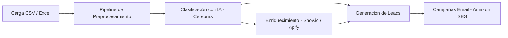

<div align="center">

# 🏭 Industrial Prospecting AI Platform

**Plataforma SaaS de prospección industrial B2B con inteligencia artificial y scraping automatizado**

[](https://www.djangoproject.com/)
[](https://www.django-rest-framework.org/)
[](https://nextjs.org/)
[](https://www.postgresql.org/)
[](https://docs.celeryq.dev/)
[](https://redis.io/)
[](https://www.docker.com/)
[](https://aws.amazon.com/ses/)
[](https://cerebras.ai/)
[]()

</div>

---

## 📋 Visión General

Sistema inteligente que automatiza el proceso completo de prospección comercial B2B para la venta de remolques y equipos industriales. La plataforma consume directorios empresariales (CSV, Excel, Google Maps), los limpia, clasifica con IA, enriquece con datos de contacto y gestiona campañas de email marketing vía Amazon SES — todo desde una interfaz web moderna.



---

## 🚀 Despliegue Rápido

```bash
# 1. Clonar
git clone https://github.com/GaelBarrrera1807/ALCRET-MAILING-BETA.git
cd ALCRET-MAILING-BETA

# 2. Configurar variables de entorno
cp .env.example .env
# Editar .env con tus credenciales (DB, API keys, etc.)

# 3. Levantar con Docker (producción)
docker compose -f docker-compose.prod.yml --env-file .env up -d

# 4. Crear superusuario
docker compose -f docker-compose.prod.yml exec web python manage.py createsuperuser
```

> ⚠ **Requisitos:** Docker 24+, Docker Compose 2.20+, 4 GB RAM disponibles.

---

## 📁 Estructura del Proyecto

```
/
├── backend/                    # Django 6.0 + DRF
│   ├── apps/                   # Módulos de la aplicación
│   │   ├── users/              # Autenticación y multiempresa
│   │   ├── core/               # Modelos base (Company, Sector, Product)
│   │   ├── leads/              # Gestión de leads y scoring
│   │   ├── ai_engine/          # Análisis con IA (Cerebras)
│   │   ├── scraping/           # Web scraping y Google Maps
│   │   ├── preprocessing/      # Pipeline de limpieza y clasificación
│   │   ├── mailer/             # Email marketing (Amazon SES)
│   │   ├── analytics/          # Métricas y estadísticas
│   │   ├── companies/          # ⚠ Stub de compatibilidad
│   │   └── reports/            # Generación de reportes PDF
│   ├── config/                 # Configuración de Django
│   ├── Dockerfile              # Multi-stage (builder + runtime)
│   └── entrypoint.sh           # Entrypoint con Gunicorn
│
├── frontend/                   # Next.js 16 + React 19 + Tailwind CSS
│   └── src/
│       ├── app/                # Páginas (dashboard, companies, leads, mailer)
│       ├── components/         # Componentes reutilizables
│       └── lib/                # API client y tipos
│
├── docker-compose.yml          # Desarrollo (con hot-reload)
├── docker-compose.prod.yml     # Producción (Gunicorn + Celery)
└── .env.example                # Plantilla de variables de entorno
```

---

## 🧠 Funcionalidades Principales

### 1. Carga Masiva de Directorios
Subida de archivos **CSV**, **Excel** y scraping directo desde **Google Maps**.

### 2. Pipeline de Preprocesamiento
Limpieza, normalización, deduplicación, filtrado por reglas de industria/producto y scoring automático.

### 3. Clasificación Inteligente con IA
Motor basado en **Cerebras LLM** que analiza descripción, giro empresarial, sitio web y determina:
- Score de probabilidad de compra (1–100)
- Sector industrial detectado
- Productos recomendados
- Prioridad comercial (baja / media / alta / urgente)

### 4. Enriquecimiento de Datos
Búsqueda automática de contactos vía **Snov.io** y **Apify** (LinkedIn, redes sociales, sitios web).

### 5. Email Marketing (Amazon SES)
- Plantillas HTML con variables dinámicas (`{{ company }}`, `{{ first_name }}`)
- Campañas segmentadas por sector y prioridad
- Tracking de aperturas, clics, rebotes y bajas vía SNS webhooks

### 6. Generación de Reportes
Reportes PDF con leads, scoring, métricas comerciales y estadísticas de procesamiento.

---

## 🗄️ Arquitectura Django

```text
apps/
│
├── users/          → Organización multiempresa + usuarios
├── core/           → Company, CompanyContact, Sector, Product (tablas `companies_*`)
├── leads/          → Lead + LeadNote (scoring, prioridad, estado comercial)
├── ai_engine/      → Análisis con IA (Cerebras), AnalysisRequest/Result, PromptTemplate
├── scraping/       → ScrapingJob + ScrapedData (web, phone, social, Google Maps)
├── preprocessing/  → PreprocessingJob + PreprocessingRule (limpieza, filtrado, scoring)
├── mailer/         → EmailTemplate, EmailRecipient, EmailCampaign, CampaignSend, EmailEvent
├── analytics/      → DashboardMetric + ProcessingStats
└── reports/        → Reportes PDF
```

### Descripción de Módulos

#### users
Autenticación JWT, roles, multiempresa (Organization como tenant raíz).

#### core
- **Company**: datos de contacto, scoring, geolocalización, índices compuestos
- **CompanyContact**: contactos por empresa
- **Sector / Product**: catálogo industrial con relación M2M

#### leads
- **Lead**: lead con scoring, prioridad, estado comercial (O2O opcional con Company)
- **LeadNote**: notas de seguimiento

#### ai_engine
- **AnalysisRequest → AnalysisResult**: solicitud y resultado de análisis IA (O2O)
- **PromptTemplate**: plantillas configurables (system prompt, temperature, model)

#### scraping
- **ScrapingJob**: registro de scraping (website, phone, social, enrichment, MAPS_DISCOVERY)
- **ScrapedData**: datos scrapeados vinculados a Company
- Única relación directa: `Company.scraping_job` (FK)

#### preprocessing
- **PreprocessingJob**: pipeline de limpieza → clasificación → scoring → filtrado
- **PreprocessingRule**: reglas de industria/producto/exclusión con keywords y peso

#### mailer
- **EmailTemplate**: plantillas con variables `{{ }}` y tipos (cold_outreach, marketing, etc.)
- **EmailRecipient**: destinatarios vinculados a Lead (sin FK directa a Company)
- **EmailCampaign**: campañas con programación y tracking
- **CampaignSend**: envío individual con `ses_message_id` para webhooks SES
- **EmailEvent**: tracking (open, click, bounce, complaint, unsubscribe)

#### analytics
- **DashboardMetric**: métricas del dashboard por organización y fecha
- **ProcessingStats**: estadísticas resumidas de procesamiento

### Diagrama Entidad-Relación (ERD)

```mermaid
erDiagram
    %% ═══════════════════════════════════════════════════════════════
    %% NOTA: Todos los modelos concretos heredan de BaseModel
    %% (abstracto), que hereda de TimeStampedModel + UUIDModel:
    %%   TimeStampedModel -> created_at, updated_at
    %%   UUIDModel        -> id UUID (PK autogenerado)
    %% ═══════════════════════════════════════════════════════════════

    %% ── App: users ────────────────────────────────────────────────
    Organization {
        string    name
        string    tax_id        "RFC"
        string    phone
        string    email
        boolean   is_active
    }

    User {
        string    username
        string    password
        string    first_name
        string    last_name
        string    email
        boolean   is_active
        boolean   is_staff
        boolean   is_superuser
        string    phone
        boolean   is_organization_admin
    }

    %% ── App: core (db_table='companies_*') ────────────────────────
    Sector {
        string    name            "UK"
        text      description
    }

    Product {
        string    name            "UK"
        text      description
    }

    Company {
        string    name
        string    business_name   "Razon social"
        string    rfc
        text      description
        url       website
        email     email
        string    phone
        text      address
        string    city
        string    state
        string    country
        string    postal_code
        float     latitude        "nullable"
        float     longitude       "nullable"
        string    detected_sector
        int       score
        boolean   is_client
        boolean   is_lead
        enum      status          "pending | analyzing | analyzed | error"
        text      notes
        string    source
        string    source_file
        float     google_rating   "nullable"
        int       google_reviews_count "nullable"
        json      maps_categories
        json      opening_hours
        url       main_photo_url  "nullable"
    }

    CompanyContact {
        string    name
        string    position
        email     email
        string    phone
        boolean   is_primary
    }

    %% ── App: leads ────────────────────────────────────────────────
    Lead {
        int       score
        boolean   is_potential_client
        enum      priority        "baja | media | alta | urgente"
        string    detected_sector
        text      recommended_products
        text      analysis_summary
        text      reason
        enum      status          "new | contacted | qualified | proposal | negotiation | won | lost"
        datetime  contacted_at    "nullable"
        datetime  last_contact    "nullable"
        datetime  next_follow_up  "nullable"
        text      notes
        boolean   auto_created
    }

    LeadNote {
        text      content
    }

    %% ── App: ai_engine ────────────────────────────────────────────
    AnalysisRequest {
        enum      status          "pending | processing | completed | error"
        text      prompt_used
        json      raw_response    "nullable"
        text      error_message
        float     processing_time "segundos (nullable)"
    }

    AnalysisResult {
        int       score
        boolean   is_potential_client
        string    detected_sector
        json      recommended_products
        text      reason
        enum      priority        "baja | media | alta | urgente"
        text      summary
        json      raw_json        "nullable"
    }

    PromptTemplate {
        string    name            "UK"
        text      description
        text      system_prompt
        text      user_prompt_template
        string    model
        float     temperature
        int       max_tokens
        boolean   is_active
        int       version
    }

    %% ── App: scraping ─────────────────────────────────────────────
    ScrapingJob {
        url       url
        enum      job_type        "website | phone | social | enrichment | MAPS_DISCOVERY"
        enum      status          "pending | processing | completed | error"
        json      result          "nullable"
        text      error_message
        int       credits_consumed
    }

    ScrapedData {
        string    source
        string    data_type
        json      raw_data        "nullable"
        json      processed_data  "nullable"
    }

    %% ── App: preprocessing ────────────────────────────────────────
    PreprocessingJob {
        string    original_filename
        enum      status          "pending | processing | completed | error"
        int       total_records
        int       relevant_records
        int       filtered_records
        int       scoring_threshold
        file      cleaned_file    "nullable"
        json      stats_json
        float     processing_time "nullable"
        text      error_message
        boolean   auto_enrich_sql
        int       credits_consumed
    }

    PreprocessingRule {
        string    name
        enum      rule_type       "industry | product | exclusion | custom"
        json      keywords
        int       weight
        json      recommended_products
        boolean   is_active
        text      description
    }

    %% ── App: mailer (Amazon SES) ──────────────────────────────────
    EmailTemplate {
        string    name
        enum      template_type   "cold_outreach | marketing | follow_up | newsletter | welcome | custom"
        string    subject
        text      body_html
        json      variables
        text      description
        boolean   is_active
        int       use_count
    }

    EmailRecipient {
        email     email
        string    first_name
        string    last_name
        string    company_name
        string    sector
        boolean   is_active
        datetime  unsubscribed_at "nullable"
        string    source
        json      metadata
    }

    EmailCampaign {
        string    name
        string    subject
        text      body_html
        enum      source_filter   "all | internal | external | manual"
        enum      status          "draft | scheduled | sending | sent | paused | cancelled"
        datetime  scheduled_at    "nullable"
        datetime  sent_at         "nullable"
        int       total_recipients
        int       sent_count
        int       open_count
        int       click_count
        int       bounce_count
        int       unsubscribe_count
    }

    CampaignSend {
        uuid      tracking_id     "UK"
        string    ses_message_id  "SES message ID (db_index, nullable)"
        enum      status          "pending | sent | delivered | opened | clicked | bounced | complained | unsubscribed"
        datetime  sent_at         "nullable"
        datetime  opened_at       "nullable"
        datetime  clicked_at      "nullable"
        text      error_message
    }

    TemplateImage {
        file      image
        string    alt_text
        int       file_size
    }

    EmailEvent {
        enum      event_type      "open | click | bounce | complaint | unsubscribe"
        text      user_agent
        ip        ip_address      "nullable"
        url       url
        json      metadata
    }

    %% ── App: analytics ────────────────────────────────────────────
    DashboardMetric {
        string    metric_type     "enum: total_companies, total_leads, avg_score, ..."
        json      value
        date      date
    }

    ProcessingStats {
        int       total_companies
        int       total_analyzed
        int       total_pending
        int       total_errors
        int       total_leads
        int       total_potential_clients
        float     avg_score
        date      date
    }

    %% ═══════════════════════════════════════════════════════════════
    %%  RELACIONES
    %% ═══════════════════════════════════════════════════════════════

    %% users
    Organization  ||--o{ User                : "users"
    Organization  ||--o{ Company             : "companies"
    Organization  ||--o{ Lead                : "leads"
    Organization  ||--o{ AnalysisRequest     : "analysis_requests"
    Organization  ||--o{ ScrapingJob         : "scraping_jobs"
    Organization  ||--o{ PreprocessingJob    : ""
    Organization  ||--o{ EmailTemplate       : "email_templates"
    Organization  ||--o{ EmailRecipient      : "email_recipients"
    Organization  ||--o{ EmailCampaign       : "email_campaigns"
    Organization  ||--o{ TemplateImage       : "template_images"
    Organization  ||--o{ DashboardMetric     : "metrics"
    Organization  ||--o{ ProcessingStats     : "processing_stats"

    User          ||--o{ LeadNote            : ""
    User          ||--o{ Lead                : "assigned_leads"

    %% core
    Sector        ||--o{ Company             : "companies"
    Sector        ||--o{ PreprocessingRule   : ""
    Product       }o--o{ Sector              : "sectors"

    ScrapingJob   ||--o{ Company             : "companies"

    Company       ||--o{ CompanyContact      : "contacts"
    Company       ||--o| Lead                : "lead"
    Company       ||--o{ AnalysisRequest     : "analysis_requests"
    Company       ||--o{ AnalysisResult      : "analysis_results"
    Company       ||--o{ ScrapedData         : "scraped_data"

    CompanyContact ||--o{ Lead               : "leads"

    %% leads
    Lead          ||--o{ LeadNote            : "notes_list"
    Lead          ||--o{ EmailRecipient      : "email_recipients"

    %% ai_engine
    AnalysisRequest ||--|| AnalysisResult    : "result"

    %% mailer
    EmailTemplate ||--o{ EmailCampaign       : "campaigns"
    EmailCampaign ||--o{ CampaignSend        : "sends"
    EmailRecipient ||--o{ CampaignSend       : "campaign_sends"
    CampaignSend  ||--o{ EmailEvent          : "events"
```



---

## 🔧 Arquitectura Tecnológica

### Backend
| Tecnología | Uso |
|---|---|
| **Django 6.0 + DRF 3.15** | API REST con JWT, filtros, paginación |
| **Celery 5.4 + Redis 7** | Tareas asíncronas (análisis IA, scraping, envío de emails) |
| **PostgreSQL 16** | Base de datos principal |
| **Gunicorn** | Servidor WSGI para producción |
| **Amazon S3** | Almacenamiento de archivos estáticos y media (opcional) |

### Frontend
| Tecnología | Uso |
|---|---|
| **Next.js 16 + React 19** | SSR, App Router, Server Components |
| **Tailwind CSS v4** | Estilos utilitarios |
| **TypeScript** | Tipado estático |

### Inteligencia Artificial
| Servicio | Propósito |
|---|---|
| **Cerebras API** | Clasificación de empresas y recomendación de productos |
| **Snov.io API** | Enriquecimiento de contactos por dominio |
| **Apify API** | Scraping de LinkedIn, Google Maps y redes sociales |

---

## 📊 Reglas de Clasificación IA

**Score alto** si la empresa menciona:
transporte pesado, logística, contenedores, flotillas, carga industrial, operaciones portuarias, construcción, hidrocarburos, petroquímica, maquinaria pesada, operaciones agrícolas.

**Score bajo** si es: retail pequeño, negocios administrativos, comercios locales, empresas sin actividad logística.

### Recomendación de Productos por Sector

| Sector | Productos |
|---|---|
| Transporte | Cajas secas, Plataformas, Portacontenedores, Dolly |
| Construcción | Volteos, Plataformas, Equipos especiales |
| Petrolera / Petroquímica | Tanques, Plataformas, Equipos especiales |
| Agrícola | Tolvas, Plataformas, Volteos |
| Portuaria | Portacontenedores, Plataforma multimodal, Porta contenedor extensible |

### Formato de Respuesta IA

```json
{
  "empresa": "",
  "sector_detectado": "",
  "score": 0,
  "cliente_potencial": true,
  "productos_recomendados": [],
  "motivo": "",
  "prioridad": "alta"
}
```

---

## 🐳 Despliegue con Docker

### Desarrollo

```bash
docker compose up -d
# Backend: http://localhost:8000
# Frontend: http://localhost:3000
# MailHog:  http://localhost:8025
```

### Producción (AWS EC2)

```bash
# Variables de entorno
cp .env.example .env.prod
# Editar .env.prod con credenciales reales

# Construir y levantar
docker compose -f docker-compose.prod.yml --env-file .env.prod up -d

# Migrar base de datos
docker compose -f docker-compose.prod.yml exec web python manage.py migrate

# Crear superusuario
docker compose -f docker-compose.prod.yml exec web python manage.py createsuperuser

# Ver logs
docker compose -f docker-compose.prod.yml logs -f web celery_worker
```

> 💡 Para usar S3, añade `USE_S3=true` y configura `AWS_ACCESS_KEY_ID`, `AWS_SECRET_ACCESS_KEY`, `AWS_STORAGE_BUCKET_NAME` en `.env.prod`.

---

## 🔐 Variables de Entorno

Todas las variables requeridas están documentadas en [`.env.example`](env.example):

```env
# ⚠ REQUERIDO para producción
DJANGO_SECRET_KEY=<generar clave segura>
DJANGO_ALLOWED_HOSTS=<tus-dominios>
DB_PASSWORD=<contraseña-segura>
REDIS_PASSWORD=<contraseña-segura>
CEREBRAS_API_KEY=<tu-api-key>
APIFY_API_KEY=<tu-api-key>
SNOV_CLIENT_ID=<tu-client-id>
SNOV_CLIENT_SECRET=<tu-client-secret>
```

---

## 📄 Licencia

**Uso interno / proprietary.** Este software es propiedad de la empresa y no está autorizado para distribución pública.

---

## 🤝 Contribución

1. Haz fork del repositorio
2. Crea una rama (`git checkout -b feature/nueva-funcionalidad`)
3. Haz commit de tus cambios
4. Push a la rama (`git push origin feature/nueva-funcionalidad`)
5. Abre un Pull Request
